# Copilot Agent 架构设计说明

## 1. 项目定位

该项目定位是一个通用 Agent Harness，目标不是封装单一业务流程，而是提供一套可扩展的智能体运行底座，覆盖以下能力：

- 基于 FastAPI 暴露标准 HTTP 接口
- 基于 LangGraph / deepagents 构建可持续运行的 Agent
- 支持 Skills能力
- 支持会话、长期记忆、工具调用、定时任务、语音识别、图片多模态理解、Excel 上传解析、前端聊天界面
- 支持按 `user_id` 做上下文隔离
- 预留子智能体扩展位，后续可接入多智能体编排
- 支持会话级沙箱工作区和 Docker 命令执行
- 支持 Langfuse 观测

它适合做“面向多用户、多会话、多工具，多智能体”的智能体后端，而不是一次性 Demo。

---

## 2. 解决的问题

这个项目主要解决以下几类问题：

### 2.1 会话型智能体服务

- 用户通过 Web/H5 界面与智能体交互
- 支持流式对话
- 支持多会话切换与消息持久化
- 对外通过 AGUI 协议暴露标准化 Agent 对话入口

### 2.2 长期记忆与用户偏好

- 将用户长期偏好从短期对话中分离出来
- 支持跨 session 复用用户画像
- 对历史经验进行压缩，避免 prompt 无限制膨胀

### 2.3 工具执行与隔离

- Agent 可以通过工具读写文件、管理 skills、执行命令
- 每个 session 绑定独立 workspace，避免不同会话相互污染
- 通过 Docker 执行命令，提升执行隔离性

### 2.4 自动任务执行

- 用户可以创建、删除、查询定时任务
- 定时任务复用同一 Agent 图和同一会话 sandbox
- 执行记录可追踪

### 2.5 可观测性

- 接入 Langfuse，对聊天链路和定时任务链路进行 tracing

### 2.6 多模态与文件解析

- 支持前端上传图片，并通过 AGUI multimodal `binary` 内容传给具备视觉能力的模型处理
- 支持前端上传 Excel 文件，将文件保存到当前 session sandbox 的 `/uploads` 目录
- 支持 Agent 通过 `parse_excel_file` 工具读取 Excel workbook/sheet 结构和预览数据
- 通过 skill 指令约束 Excel 分析优先使用工程化 tool，避免模型自行猜路径或写脚本解析

---

## 3. 总体架构

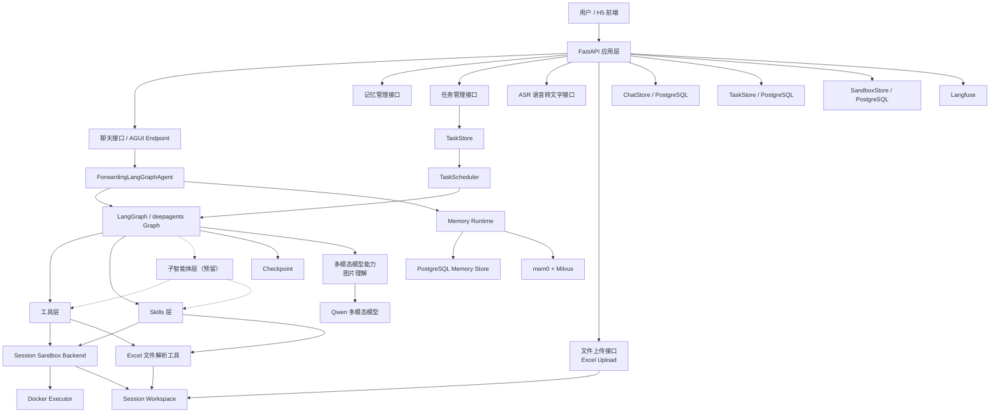

详细架构图：

```mermaid
flowchart TD
    subgraph Client["客户端层"]
        H5["H5 聊天页面\napp/frontend/index.html"]
        Voice["语音输入\n浏览器录音上传"]
        Image["图片上传\nAGUI binary multimodal"]
        Excel["Excel 上传\n.xlsx / .xlsm"]
    end

    subgraph API["FastAPI 应用层\napp/main.py"]
        Auth["Auth Middleware\n解析 JWT / user_id\napp/auth/auth_context.py"]
        Root["基础接口\n/health /chat /debug/whoami"]
        AGUI["AGUI Agent Endpoint\n默认 /v1/chat\nadd_langgraph_fastapi_endpoint"]
        ChatAPI["Chat REST API\n/api/chat/*\n会话/消息管理"]
        MemoryAPI["Memory API\n/api/memory/*\n记忆管理面板"]
        TaskAPI["Task API\n/api/tasks/*\n任务管理"]
        ASRAPI["ASR API\n/api/asr/transcribe\n语音转文字"]
        FileAPI["File API\n/api/files/excel/upload\nExcel 上传"]
    end

    Image --> H5
    Excel --> H5
    Voice --> H5
    H5 --> Auth
    Auth --> Root
    Auth --> AGUI
    Auth --> ChatAPI
    Auth --> MemoryAPI
    Auth --> TaskAPI
    Auth --> FileAPI
    Auth --> ASRAPI

    subgraph AgentLayer["Agent 运行层"]
        Runtime["ForwardingLangGraphAgent\napp/agent/runtime.py\n记忆注入 / 消息持久化 / sandbox 绑定"]
        Graph["LangGraph + deepagents Graph\napp/graph.py\ncreate_deep_agent(...)"]
        Subagents["Subagents 预留\n后续可接入子智能体编排"]
        Prompt["System Prompt\napp/prompts/prompt.py"]
        Model["LLM 模型层\napp/model/llm.py\nQwen / DeepSeek"]
        Checkpoint["Checkpoint\nRedis AsyncRedisSaver 或 MemorySaver"]
    end

    AGUI --> Runtime
    Runtime --> Graph
    Graph -.-> Subagents
    Prompt --> Graph
    Graph --> Model
    Graph --> Checkpoint

    subgraph Tools["工具层"]
        TaskTools["任务工具\ncreate/delete/query scheduled task\napp/tasks/tools.py"]
        SkillTools["Skills 工具\ninstall/list skills\napp/tools/skills_manager.py"]
        SandboxInfo["Sandbox 信息工具\napp/tools/sandbox_info.py"]
        ExcelTools["Excel 解析工具\nparse_excel_file / list_uploaded_excel_files\napp/files/tools.py"]
        MCP["MCP Tools\nlangchain_mcp_adapters\napp/config/mcp_config.py"]
    end

    Graph --> TaskTools
    Graph --> SkillTools
    Graph --> SandboxInfo
    Graph --> ExcelTools
    Graph --> MCP

    subgraph Sandbox["会话级沙箱层"]
        SandboxCtx["Sandbox Context\nContextVar 绑定当前 session\napp/sandbox/context.py"]
        SandboxManager["SandboxManager\n每个 session 绑定 workspace\napp/sandbox/manager.py"]
        SandboxBackend["SessionSandboxBackend\n文件工具 + Docker execute\napp/sandbox/backend.py"]
        Workspace["Session Workspace\n/tmp/copilot-agent-sandboxes/{user}/{session}/{sandbox}"]
        Docker["Docker Executor\n/workspace 挂载执行"]
        SandboxStore["SandboxStore\nsandbox 元数据\napp/sandbox/store.py"]
    end

    Runtime --> SandboxCtx
    SandboxCtx --> SandboxManager
    SandboxManager --> Workspace
    SandboxManager --> SandboxStore
    FileAPI --> Workspace
    ExcelTools --> Workspace
    Graph --> SandboxBackend
    SandboxBackend --> Workspace
    SandboxBackend --> Docker

    subgraph Memory["分层记忆系统"]
        MemRuntime["Memory Runtime\napp/memory/memory_runtime.py\n召回 / 注入 / 写入"]
        Instruction["Instruction Memory\n系统/Agent/User 规则\n每用户 1 agent + 1 user"]
        Profile["Profile Memory\n用户画像 / 偏好"]
        Episode["Episode Memory\n历史经验"]
        Working["Working Memory\n当前会话状态"]
        Extractor["Memory Extractor\napp/memory/extractor.py"]
        Compactor["Memory Compactor\nqwen3-max 压缩 episode\napp/memory/compactor.py"]
        EpisodeVector["Episode Vector Store\napp/memory/episode_vector.py"]
    end

    Runtime --> MemRuntime
    MemRuntime --> Instruction
    MemRuntime --> Profile
    MemRuntime --> Episode
    MemRuntime --> Extractor
    Compactor --> Episode
    Episode --> EpisodeVector
    Working --> Checkpoint

    subgraph Storage["存储层"]
        PGChat["PostgreSQL\nchat_sessions / chat_messages"]
        PGMemory["PostgreSQL\nmemory_instructions\nmemory_profiles\nmemory_episodes\nmemory_recall_logs\nmemory_audit_logs"]
        PGTasks["PostgreSQL\nscheduled_tasks\nscheduled_task_runs"]
        PGSandbox["PostgreSQL\nsandbox_sessions"]
        Redis["Redis\nLangGraph checkpoint"]
        MilvusProfile["Milvus\nmem0 profile collection"]
        MilvusEpisode["Milvus\nepisode vector collection"]
    end

    ChatAPI --> PGChat
    Runtime --> PGChat
    MemoryAPI --> PGMemory
    MemRuntime --> PGMemory
    Instruction --> PGMemory
    Profile --> PGMemory
    Episode --> PGMemory
    Compactor --> PGMemory
    Profile --> MilvusProfile
    EpisodeVector --> MilvusEpisode
    TaskAPI --> PGTasks
    TaskTools --> PGTasks
    SandboxStore --> PGSandbox
    Checkpoint --> Redis

    subgraph Scheduler["定时任务执行层"]
        TaskScheduler["TaskScheduler\napp/tasks/scheduler.py\n轮询到期任务"]
        TaskExecutor["run_task_with_agent(...)\n复用 graph + user_id + session sandbox"]
    end

    PGTasks --> TaskScheduler
    TaskScheduler --> TaskExecutor
    TaskExecutor --> Graph
    TaskExecutor --> SandboxManager

    subgraph External["外部服务"]
        DashScope["DashScope / Qwen\nLLM + ASR + Embedding"]
        QwenVL["Qwen 多模态模型\n图片理解"]
        DeepSeek["DeepSeek API"]
        Langfuse["Langfuse\nTracing / Observability"]
        MCPServer["外部 MCP Server"]
        DockerDaemon["宿主机 Docker Daemon"]
    end

    Model --> DashScope
    Model --> QwenVL
    Model --> DeepSeek
    ASRAPI --> DashScope
    EpisodeVector --> DashScope
    Runtime --> Langfuse
    TaskExecutor --> Langfuse
    MCP --> MCPServer
    Docker --> DockerDaemon
```

由于详细架构图节点较多，下面按运行域拆成几张局部图，便于阅读。

### 3.1 接入层与 Agent 运行链路

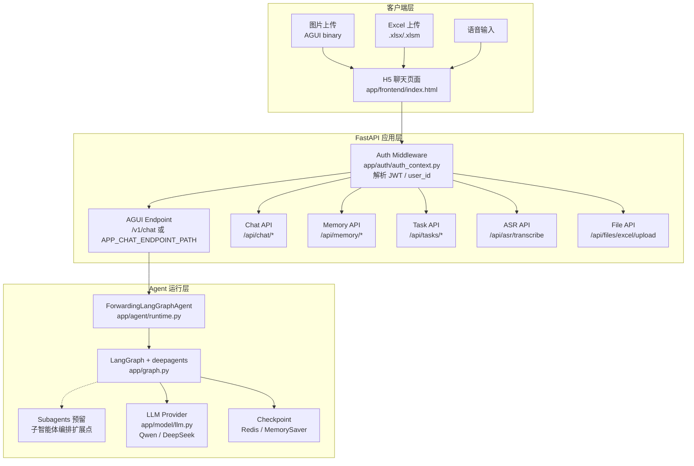

### 3.2 Agent 工具与沙箱执行链路

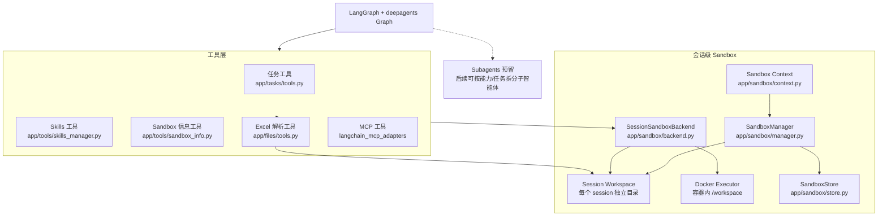

### 3.3 记忆系统链路

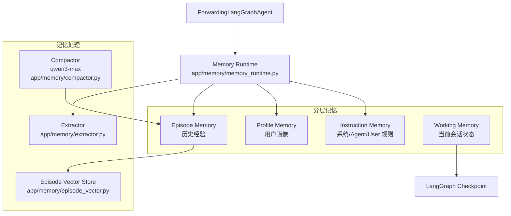

### 3.4 存储与外部依赖

```mermaid
flowchart TD
    subgraph Storage["存储层"]
        PGChat["PostgreSQL\nchat_sessions / chat_messages"]
        PGMemory["PostgreSQL\nmemory_*"]
        PGTasks["PostgreSQL\nscheduled_tasks / runs"]
        PGSandbox["PostgreSQL\nsandbox_sessions"]
        Redis["Redis\ncheckpoint"]
        MilvusProfile["Milvus\nprofile collection"]
        MilvusEpisode["Milvus\nepisode vector collection"]
    end

    subgraph External["外部服务"]
        DashScope["DashScope / Qwen\nLLM + ASR + Embedding"]
        DeepSeek["DeepSeek API"]
        Langfuse["Langfuse\nTracing"]
        DockerDaemon["宿主机 Docker Daemon"]
        MCPServer["外部 MCP Server"]
    end

    ChatAPI["Chat API / Runtime"] --> PGChat
    MemoryRuntime["Memory Runtime"] --> PGMemory
    Profile["Profile Memory"] --> MilvusProfile
    EpisodeVector["Episode Vector Store"] --> MilvusEpisode
    TaskScheduler["TaskScheduler"] --> PGTasks
    SandboxStore["SandboxStore"] --> PGSandbox
    Checkpoint["Checkpoint"] --> Redis

    Model["Model Layer"] --> DashScope
    Model --> DeepSeek
    ASR["ASR API"] --> DashScope
    EpisodeVector --> DashScope
    Runtime["Agent Runtime"] --> Langfuse
    Docker["Docker Executor"] --> DockerDaemon
    MCP["MCP Tools"] --> MCPServer
```

### 3.5 定时任务执行链路

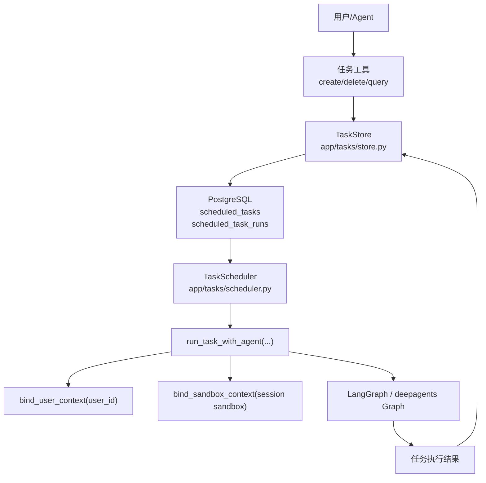

---

## 4. 代码结构与模块职责

### 4.1 应用入口

核心文件：

- `/Users/sx001/Documents/copilot_agent/app/main.py`

职责：

- 初始化 FastAPI 应用
- 初始化 graph、chat store、memory store、sandbox store、task store
- 注册业务路由
- 启动定时任务调度器
- 启动记忆压缩器
- 注册 AGUI/LangGraph 对话入口

这层是系统装配层，不承担复杂业务逻辑。

---

### 4.2 Agent 运行层

核心文件：

- `/Users/sx001/Documents/copilot_agent/app/graph.py`
- `/Users/sx001/Documents/copilot_agent/app/agent/runtime.py`
- `/Users/sx001/Documents/copilot_agent/app/main.py`
- `/Users/sx001/Documents/copilot_agent/app/prompts/prompt.py`
- `/Users/sx001/Documents/copilot_agent/app/model/llm.py`

职责：

- 基于 `create_deep_agent(...)` 创建 Agent Graph
- 统一接入模型、工具、skills、checkpointer、sandbox backend
- 预留 `subagents` 扩展点，后续可按任务类型或能力域拆分子智能体
- 在每次请求时注入长期记忆
- 统一持久化用户消息和助手消息
- 绑定 `user_id`、`session_id`、sandbox context
- 通过 `add_langgraph_fastapi_endpoint(...)` 将 Agent Graph 暴露为 AGUI 协议接口

### 4.2.1 AGUI 协议接入

当前项目并不是自定义一套聊天流式协议，而是通过 `ag_ui_langgraph` 暴露 AGUI 风格的标准 Agent 接口。

核心位置：

- `/Users/sx001/Documents/copilot_agent/app/main.py`

关键接入点：

- `add_langgraph_fastapi_endpoint(app, agent=agent, path=settings.chat_endpoint_path)`

当前默认路径：

- `APP_CHAT_ENDPOINT_PATH`
- 未配置时默认是 `/v1/chat`
- 如果设置了 `APP_API_PREFIX`，则可挂到带前缀的路径

AGUI 在当前项目中的作用：

- 为前端或其他客户端提供统一的 Agent 调用协议入口
- 让 LangGraph 运行事件以标准化方式输出
- 降低前后端、不同客户端之间的协议耦合
- 避免为流式消息、工具事件、Agent 运行状态单独维护一套私有协议

为什么这里使用 AGUI：

- 当前项目本质上是一个通用 Agent Harness
- 如果对外协议写死成私有 JSON 接口，后续替换前端或接入别的客户端成本会很高
- 使用 AGUI 后，Agent 运行入口和内部聊天存储、记忆、任务、沙箱模块可以解耦

需要区分两类接口：

- `AGUI 对话入口`
  - 用于真正调用智能体
  - 由 `ag_ui_langgraph` 托管
- `业务管理接口`
  - 例如 `/api/chat/*`、`/api/memory/*`、`/api/tasks/*`
  - 用于会话列表、记忆管理、任务管理、ASR 等辅助能力

也就是说：

- AGUI 负责“Agent 对话协议”
- FastAPI 其余 REST 路由负责“平台管理能力”

当前模型封装支持：

- DashScope / Qwen
- DeepSeek（已封装，但当前主链路默认走 Qwen）

---

### 4.3 鉴权与用户上下文

核心文件：

- `/Users/sx001/Documents/copilot_agent/app/auth/auth_context.py`

职责：

- 从 `Authorization: Bearer <jwt>` 中解析用户身份
- 提取 `user_id`
- 当鉴权头不存在时，回退到默认用户 `DEFAULT_USER_ID`
- 将当前 `user_id` 放入 `ContextVar`

设计特点：

- 当前系统内部所有长期记忆、会话、任务，统一按 `user_id` 隔离
- 避免把 token/base_url 等请求级参数耦合到业务运行时中

---

### 4.4 聊天存储层

核心文件：

- `/Users/sx001/Documents/copilot_agent/app/chat/store.py`
- `/Users/sx001/Documents/copilot_agent/app/chat/api.py`

职责：

- 管理 `chat_sessions`
- 管理 `chat_messages`
- 支持会话创建、删除、消息查询

设计特点：

- 会话和消息持久化到 PostgreSQL
- 当前不再依赖 SSE `/stream` 推送链路
- 聊天记录作为“原始归档层”，不是长期记忆本身

这层解决的是“会话可回放”和“消息持久化”，而不是“长期记忆”。

---

### 4.5 记忆系统

核心文件：

- `/Users/sx001/Documents/copilot_agent/app/memory/store.py`
- `/Users/sx001/Documents/copilot_agent/app/memory/memory_runtime.py`
- `/Users/sx001/Documents/copilot_agent/app/memory/extractor.py`
- `/Users/sx001/Documents/copilot_agent/app/memory/compactor.py`
- `/Users/sx001/Documents/copilot_agent/app/memory/api.py`
- `/Users/sx001/Documents/copilot_agent/app/memory/mem0_store.py`

当前采用分层记忆设计：

#### 4.5.1 Instruction Memory

作用：

- 存储系统/智能体/用户级长期规则

当前实现：

- `global` 级规则：可多条
- `agent` 级规则：每个用户仅保留 1 条
- `user` 级规则：每个用户仅保留 1 条

特点：

- 不走向量检索
- 直接注入 prompt
- 优先级最高

#### 4.5.2 Profile Memory

作用：

- 存储用户长期偏好和稳定画像

当前实现：

- PostgreSQL 保存结构化事实
- mem0 + Milvus 提供抽取与语义检索

特点：

- 写入时优先使用 mem0 做画像事实提取
- 注入时只允许少量白名单 key 进入 prompt
- 默认跨 session 生效

#### 4.5.3 Episode Memory

作用：

- 存储历史经验和可复用上下文摘要

当前实现：

- PostgreSQL 主存
- Milvus 向量索引
- 查询时采用 PostgreSQL + 向量检索混合召回

第二阶段已实现：

- 后台记忆压缩器使用 `qwen3-max`
- 将多条旧 episode 压缩为一条高质量摘要
- 原始 episode 会被标记为 `archived`
- 新写入或压缩后的 episode 会同步写入 Milvus 向量索引

当前召回策略：

- PostgreSQL 侧负责：
  - 关键词命中
  - 重要度加权
  - 时间衰减
- Milvus 侧负责：
  - 语义相似度召回
  - 使用千问兼容 embedding 模型生成向量
- Runtime 层负责：
  - 合并 PostgreSQL 与向量召回结果
  - 统一排序
  - 只注入少量最相关 episode

这一设计的意义在于：

- 仅依赖 PostgreSQL 检索时，更擅长处理关键词显式命中
- 仅依赖向量检索时，更擅长处理语义相近但字面不同的问题
- 混合召回可以兼顾“精确匹配能力”和“语义泛化能力”

Episode 混合召回时序图：

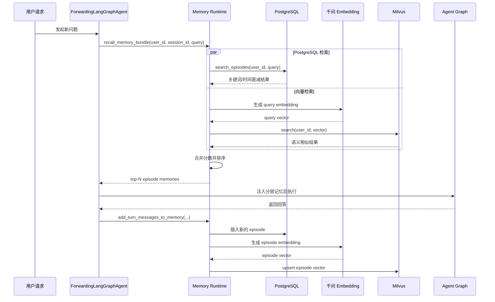

#### 4.5.4 Working Memory

作用：

- 存储当前会话的短期运行状态

当前实现：

- LangGraph checkpoint
- Redis 可用时使用 `AsyncRedisSaver`
- 否则退回 `MemorySaver`

#### 4.5.5 记忆注入策略

当前策略是：

- 多存：archive / profile / episode 都可以存
- 少注入：prompt 只注入有限条数和有限字符数
- 分层裁剪：
  - `instruction` 少量固定注入
  - `profile` 白名单注入
  - `episode` 只取少量最相关
- 定期压缩：由 `MemoryCompactor` 异步处理

这是当前项目中最重要的工程化设计之一。

记忆系统结构图：

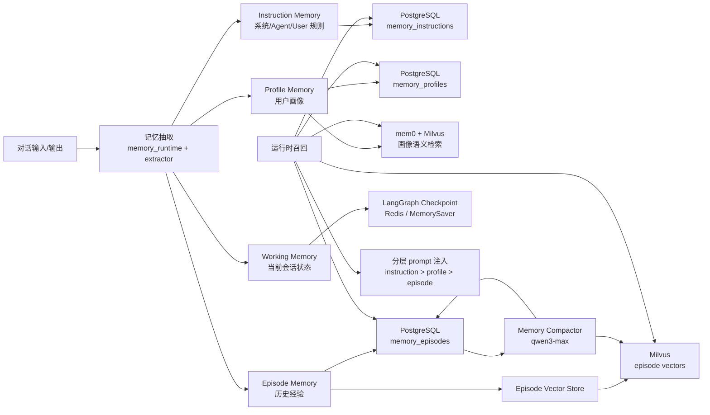

---

### 4.6 Sandbox 执行层

核心文件：

- `/Users/sx001/Documents/copilot_agent/app/sandbox/context.py`
- `/Users/sx001/Documents/copilot_agent/app/sandbox/manager.py`
- `/Users/sx001/Documents/copilot_agent/app/sandbox/backend.py`
- `/Users/sx001/Documents/copilot_agent/app/sandbox/store.py`
- `/Users/sx001/Documents/copilot_agent/app/tools/sandbox_info.py`

职责：

- 为每个 `session_id` 分配独立 sandbox workspace
- 让文件工具和命令执行都绑定到当前 session
- 命令执行通过 Docker 隔离

当前设计要点：

- 会话与 sandbox 是一对一绑定关系
- Agent 仍然是全局单例，不是每个 session 一个 agent 实例
- 真正隔离的是执行环境，不是 Python Agent 对象

优点：

- 避免不同会话之间文件污染
- 支持“同一 session 的文件持续存在”
- 后续可以把执行器从 Docker 替换为远端沙箱，不影响主链路

已处理的一类典型问题：

- 文件工具路径和容器路径不一致导致命令执行失败
- 当前已统一将可执行路径映射到容器内 `/workspace`

---

### 4.7 定时任务模块

核心文件：

- `/Users/sx001/Documents/copilot_agent/app/tasks/store.py`
- `/Users/sx001/Documents/copilot_agent/app/tasks/scheduler.py`
- `/Users/sx001/Documents/copilot_agent/app/tasks/tools.py`
- `/Users/sx001/Documents/copilot_agent/app/tasks/api.py`

职责：

- 创建、删除、查询任务
- 轮询到期任务
- 记录任务执行结果
- 让任务执行复用同一 graph / user_id / session sandbox

设计特点：

- 任务是 PostgreSQL 持久化的
- 调度器是进程内轮询器
- 执行器直接调用 Agent Graph，而不是独立的 cron 脚本

这使任务系统保持了“智能体驱动”的一致性。

---

### 4.8 前端界面

核心文件：

- `/Users/sx001/Documents/copilot_agent/app/frontend/index.html`

职责：

- 提供 H5 聊天界面
- 管理多会话
- 展示消息历史
- 调用 ASR 接口上传音频转文字
- 支持图片选择并按 AGUI multimodal `binary` 格式发送给 Agent
- 支持 Excel 文件上传，并将上传结果转换成可触发工具调用的用户提示
- 提供记忆管理面板

特点：

- 单文件前端，部署简单
- 适合快速集成和容器化部署
- 前端不承载核心业务逻辑，主要承担 UI 和 API 调用

---

### 4.9 多模态图片与 Excel 文件解析

核心文件：

- `/Users/sx001/Documents/copilot_agent/app/frontend/index.html`
- `/Users/sx001/Documents/copilot_agent/app/files/api.py`
- `/Users/sx001/Documents/copilot_agent/app/files/tools.py`
- `/Users/sx001/Documents/copilot_agent/app/graph.py`
- `/Users/sx001/Documents/copilot_agent/app/skills/data-analysis/SKILL.md`

#### 4.9.1 图片解析链路

当前图片能力走 AGUI 多模态消息链路，不单独落库为文件解析任务。

处理方式：

- 前端读取图片为 base64 data URL
- 发送 AGUI 兼容的 `binary` 内容片段：
  - `type=binary`
  - `mimeType=image/png|image/jpeg|image/webp|image/gif`
  - `data=<base64>`
  - `filename=<原文件名>`
- `ag_ui_langgraph` 将 AGUI multimodal 内容转换为 LangChain/模型可识别的多模态消息
- 具备图片理解能力的 Qwen 多模态模型根据图片内容回答用户问题

设计边界：

- 图片内容不通过本项目自定义文件解析器处理
- 图片不进入 sandbox `/uploads` 目录
- 图片理解依赖模型本身的视觉能力，因此当前模型需要支持 vision/multimodal 输入

#### 4.9.2 Excel 上传与解析链路

当前 Excel 能力走“上传接口 + Agent 工具”的工程化链路。

处理方式：

- 前端通过 `/api/files/excel/upload` 上传 `.xlsx/.xlsm`
- 后端根据当前 `user_id` 和 `session_id` 获取 session sandbox
- 文件保存到当前 session workspace 的 `/uploads` 目录
- 上传成功后前端把 `/uploads/xxx.xlsx` 写入输入框提示
- Agent 运行时绑定同一个 sandbox context
- Agent 调用 `parse_excel_file(file_path="/uploads/xxx.xlsx")`
- 工具使用 `openpyxl` 读取 workbook、sheet、行列数和预览行

相关工具：

- `parse_excel_file(file_path, max_rows_per_sheet=50)`
- `list_uploaded_excel_files()`

设计边界：

- 当前仅支持 `.xlsx/.xlsm`
- 当前默认返回每个 sheet 的预览数据，最大行数由 `max_rows_per_sheet` 控制
- 更复杂的统计分析应在工具返回的结构化数据基础上完成；如果需要全量大表分析，后续可扩展为分页读取或 DuckDB 分析工具
- `data-analysis` skill 已被改为工具使用指南，约束模型优先使用 `parse_excel_file`，避免与工具形成两套解析路径

Excel 上传解析时序图：

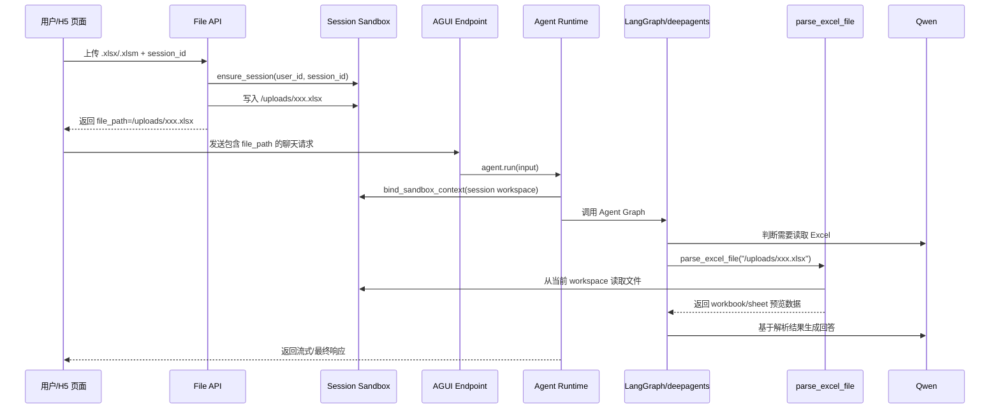

图片解析时序图：

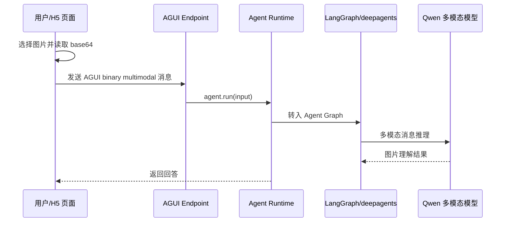

---

### 4.10 ASR 模块

核心文件：

- `/Users/sx001/Documents/copilot_agent/app/asr/api.py`

职责：

- 接收音频文件
- 调用 DashScope/OpenAI 兼容接口做语音转文字

特点：

- 支持 `audio/transcriptions`
- 支持 `chat/completions + input_audio`
- 支持自动 fallback

---

### 4.11 观测层

核心文件：

- `/Users/sx001/Documents/copilot_agent/app/observability/langfuse_runtime.py`

职责：

- 初始化 Langfuse
- 向 LangChain / LangGraph 注入 callback
- 统一打上 `user_id`、`session_id`、`trace_name`

特点：

- 聊天和定时任务两条链路都支持 tracing
- 便于排查 Agent 调用和任务执行问题

---

## 5. 关键技术选型

| 技术 | 当前用途 | 选择原因 |
|---|---|---|
| FastAPI | HTTP 服务、生命周期管理 | 轻量、异步友好、接口组织清晰 |
| LangGraph | Agent 状态机与 checkpoint | 适合复杂 agent 工作流和会话态管理 |
| deepagents | 高层 Agent 构建 | 封装工具、skills、backend 接入 |
| DashScope / Qwen | 主模型与压缩模型 | 当前环境中可直接使用，且与项目已深度集成 |
| PostgreSQL | 会话、任务、记忆、sandbox 元数据主存 | 关系型数据强、事务能力强、适合治理 |
| Redis | checkpoint 持久化 | 适合短期运行态状态 |
| mem0 + Milvus | 用户画像抽取与语义检索 | 适合做 profile 层语义能力，而非主存 |
| Docker | sandbox 命令执行隔离 | 工程上可落地，部署成熟 |
| AGUI multimodal binary | 图片输入协议 | 与 Agent 对话入口一致，避免自定义图片协议 |
| openpyxl | Excel 文件解析 | 轻量稳定，适合 `.xlsx/.xlsm` workbook 读取 |
| Langfuse | tracing / observability | 支持 LLM 链路观测 |
| 原生 H5 | 前端聊天界面 | 低成本、部署简单 |

---

## 6. 请求处理主流程

### 6.1 聊天请求流程

1. 前端发起聊天请求
2. 请求进入 AGUI 对话入口
3. FastAPI 解析 JWT，得到 `user_id`
4. 运行时根据 `session_id` 绑定 sandbox
5. 运行时根据 `user_id` 召回 instruction/profile/episode
6. 将分层记忆注入系统消息
7. 调用 Agent Graph 执行
8. 记录聊天消息
9. 将本轮用户消息与助手回复写入记忆系统

聊天请求链路时序图：

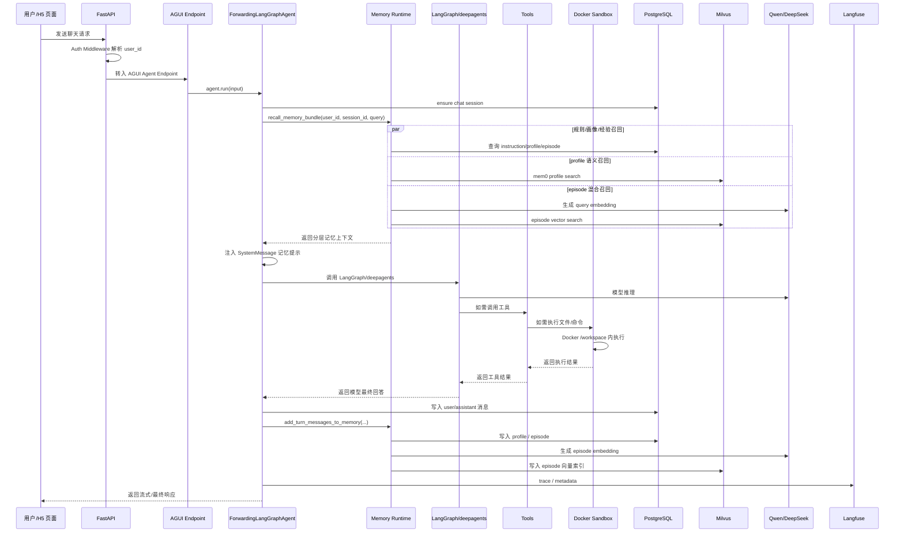

### 6.2 定时任务流程

1. 任务存入 `scheduled_tasks`
2. 调度器轮询到期任务
3. 为任务恢复 `session_id` 对应的 sandbox
4. 调用相同 graph 执行任务
5. 记录任务运行结果
6. 对任务产出的经验可继续进入 episode memory

### 6.3 图片与 Excel 请求流程

图片请求流程：

1. 前端将图片读取为 base64
2. 通过 AGUI `binary` multimodal content 随用户消息发送
3. Agent Graph 将多模态消息交给支持 vision 的模型
4. 模型直接基于图片内容生成回答

Excel 请求流程：

1. 前端调用 `/api/files/excel/upload` 上传 `.xlsx/.xlsm`
2. 后端将文件保存到当前 session sandbox 的 `/uploads`
3. 前端把返回的 `file_path` 写入用户输入提示
4. 用户发送问题后，Agent 根据 skill 指令优先调用 `parse_excel_file`
5. 工具从当前 session sandbox 读取 Excel 并返回结构化预览
6. 模型基于工具结果回答用户问题

---

## 7. 当前架构的优点

### 7.1 分层清晰

- 应用装配、Agent 运行、记忆、会话、任务、沙箱、ASR 分层明确
- 模块之间边界相对清晰，便于替换实现

### 7.2 适合做通用 Agent Harness

- 没有把某一具体业务写死在主链路中
- 用户隔离、会话隔离、工具隔离都有明确模型

### 7.3 持久化设计完整

- 聊天、任务、记忆、sandbox 元数据都有独立存储
- 系统重启后多数状态可以恢复

### 7.4 扩展性较好

- 模型可替换
- 技能目录可扩展
- MCP 工具可扩展
- Sandbox 执行器后续可替换成更强隔离实现
- 图片、Excel 等输入能力通过协议和工具扩展，不需要侵入 Agent 主链路

### 7.5 记忆系统不是简单向量库堆砌

- 已经形成了 instruction / profile / episode / working 的分层设计
- 支持压缩与裁剪，不会无限注入 prompt
- `episode memory` 已升级为关系型主存 + 向量召回的混合架构，而不是单一检索方式

---

## 8. 当前架构的局限与代价

### 8.1 仍然是单进程内调度

- 定时任务调度器是进程内轮询
- 不适合特别大规模的多实例分布式任务调度

### 8.2 Sandbox 仍依赖宿主机 Docker

- 需要部署环境挂载 Docker 能力
- 路径映射和权限问题需要谨慎处理

### 8.3 前端较轻

- 当前前端适合快速集成和调试
- 不适合复杂工作台级交互

### 8.4 记忆系统仍在演进中

- `profile` 抽取虽已引入 mem0，但仍可继续优化
- `episode` 已接入 PostgreSQL + Milvus 混合召回，但召回权重、去重策略和召回日志仍可继续治理

### 8.5 文件与多模态能力仍偏轻量

- 图片解析依赖模型视觉能力，本项目当前不做 OCR/图像结构化预处理
- Excel 解析当前只支持 `.xlsx/.xlsm`
- Excel 工具默认返回预览数据，复杂全量分析需要后续扩展分页读取、DuckDB 或专用数据分析工具

### 8.6 `Mem0Store` 适配层尚未接入主链路

- 当前 `mem0` 实际主要用于 profile 抽取和 profile 语义检索
- `Mem0Store(BaseStore)` 还不是 graph 的主 store

---

## 9. 适用场景

这套架构适合：

- 多用户、多会话的通用 Agent 服务
- 需要长期记忆但不希望 prompt 失控的场景
- 需要工具调用、文件操作、命令执行的智能体
- 需要任务调度和会话持续性的智能体平台

不适合直接拿来做：

- 超高并发、强分布式调度的任务平台
- 强安全隔离的多租户代码执行平台
- 极重型前端工作台产品

---

## 10. 后续演进建议

### 10.1 优先级最高

- 继续完善 sandbox 执行链路的路径约束和错误恢复
- 给记忆系统增加更多可观测字段和治理接口
- 将任务调度从单进程轮询升级为独立 worker 模式

### 10.2 中期建议

- 继续优化 `episode memory` 的混合召回权重与召回日志可观测性
- 为前端补更强的调试视图，例如当前注入了哪些记忆
- 为 instruction/profile 提供编辑能力

### 10.3 长期建议

- 将 sandbox 执行器抽象成可替换 provider
- 引入更成熟的 job queue / worker 架构
- 进一步把 Agent Harness 抽象成可复用平台层

---

## 11. 一句话总结

这个项目当前已经不是“简单聊天机器人”，而是一套面向通用智能体后端的工程化底座：

- 用 FastAPI 承载接口
- 用 LangGraph / deepagents 承载 Agent
- 用 PostgreSQL / Redis / mem0 / Milvus 承载状态与记忆
- 用 Docker 承载 session 级执行隔离
- 用 AGUI multimodal 和 Excel 工具承载图片、表格等非纯文本输入
- 用 Langfuse 承载可观测性

它的核心价值不在某个单点功能，而在于“会话、记忆、工具、任务、沙箱、观测”这些能力已经被装配成了一套可持续演进的系统。
